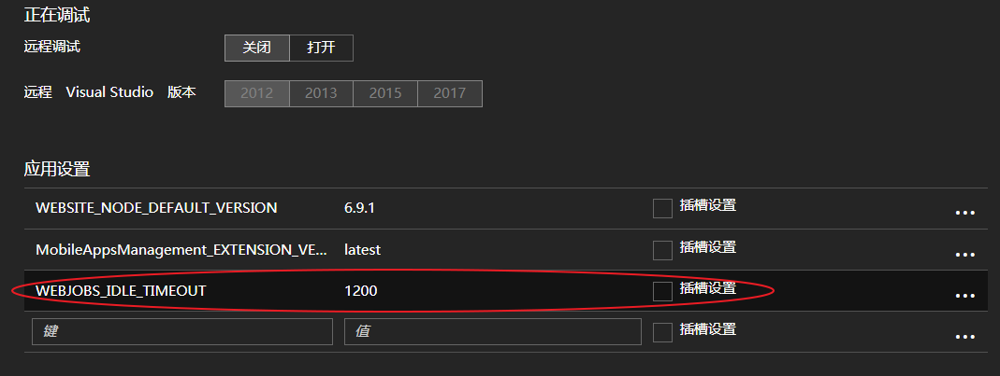
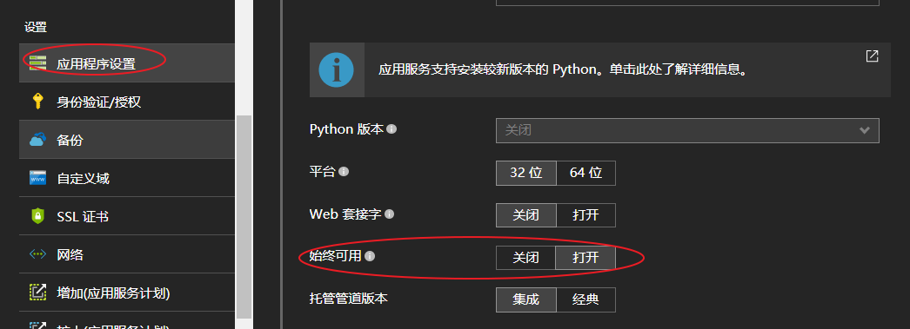

# 如何运行 idle 时间大于2分钟的计划作业

## 问题描述
当 webjob 空闲时间超过2min，Azure 将会中止运行的工作进程，导致 webjob 运行失败

## 解决方案

在管理门户修改 WEBJOBS_IDLE_TIMEOUT 配置并开启了“ always on ”。

空闲时间指的是 webjob 在2min内，没有 CPU 时间或者 output 输出，长时间在等待请求，没有任何的数据交互。

默认的 WEBJOBS_IDLE_TIMEOUT 为 120秒，Webjob 空闲时间超过了此数值，将会被中止工作进程，导致 webjob 运行失败。

可以通过以下的内容来修改 WEBJOBS_IDLE_TIMEOUT，保证 webjob 正常运行。

在应用程序设置中修改 WEBJOBS_IDLE_TIMEOUT 的配置（此处修改的时间为20分钟），同时开启“ always on ”功能。

开启” always on ” 功能

参考链接：[Web Jobs](https://github.com/projectkudu/kudu/wiki/WebJobs)
