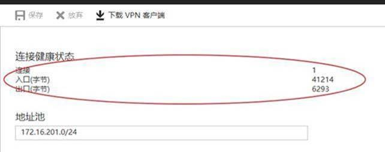
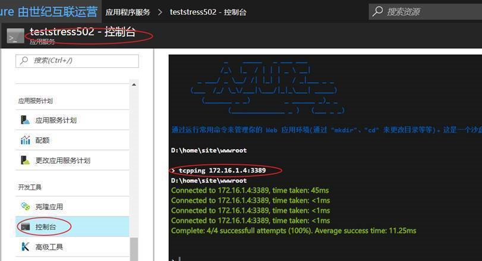

# 如何验证 Web 应用是否通过 Vnet 成功连接到其它服务

## 问题描述
Web 应用配置 Vnet 成功后，无法通过内网访问其他服务

## 解决方案
管理门户 web 应用的 console 中，通过 tcpping ip:port 验证

Web 应用连接到虚拟网络，连接数是有正常值的，即表示可以正常访问。可以在网关中点到站点配置，查看连接健康状态。

当连接数有值时，可以通过 tcpping 验证是否连接 VM 。
管理门户 web 应用的 console 中，通过 tcpping ip:port 来验证

为了保证您的 web 应用能够连接 VNET ，建议您在应用程序设置中开启” always on ”功能。

参考文档：[从 Azure Web 应用访问内网资源](https://blogs.msdn.microsoft.com/showkat/2017/02/20/access-on-premises-resource-from-azure-app-services/)
