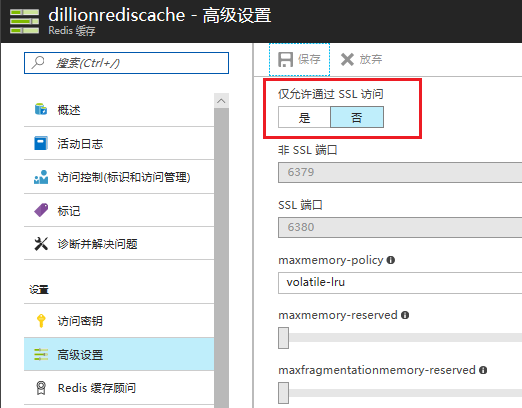
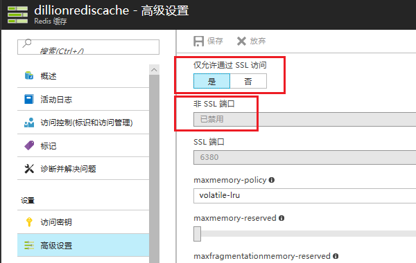
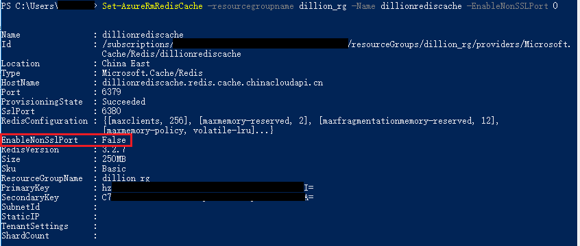
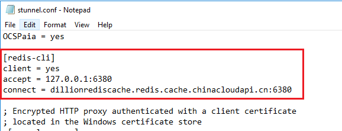

# 如何使用 Redis-Cli 连接到 Azure Redis 缓存

## 问题描述

使用 redis-cli 无法连接到 Azure Redis 缓存。

## 问题分析

Azure Redis 缓存可以通过 SSL 端口和非 SSL 端口创建连接。当使用 redis-cli 连接 Azure Redis 缓存时，由于在默认情况下 redis-cli 不支持 SSL ，所以 redis-cli 会通过非 SSL 端口创建连接。如果 Azure Redis 缓存禁用 Non-SSL 端口，就会出现 redis-cli 无法连接这种情况。

## 解决方案

本文主要使用以下两种方式连接到 Azure Redis 缓存。
1. 通过非 SSL 端口( 6379 )连接到 Azure Redis 缓存
2. 通过 SSL 端口( 6380 )连接到 Azure Redis 缓存

## 前提条件

在客户端安装 redis-cli ，本文使用的是 Redis-x64-3.2.100。您可以点击 [这里](https://github.com/MicrosoftArchive/redis/releases) 下载 redis-cli。


## 通过非 SSL 端口( 6379 )连接到 Azure Redis 缓存。

#### 启用非 SSL 端口。

> [!NOTE]
>
> 如果使用非 SSL 端口创建连接，数据以及访问密钥会通过 TCP 以明文的方式传输。

在 [Azure 门户](https://portal.azure.cn/)中使用“浏览”边栏选项卡访问缓存, 选择所需的缓存，在“高级设置”边栏选项卡中的“仅允许通过 SSL 访问”单击“否”，并单击“保存”。



也可以通过 PowerShell 执行以下代码启动非 SSL 端口。有关使用 PowerShell 管理 Redis 缓存的详细信息，请参阅[使用 Azure PowerShell 管理 Azure Redis 缓存](https://docs.azure.cn/redis-cache/cache-howto-manage-redis-cache-powershell)。

```
Set-AzureRmRedisCache -resourcegroupname <资源组名称> -Name <Redis 缓存名称> -EnableNonSSLPort 1
```


#### 连接到 Azure Redis 缓存。

使用以下命令连接到 Azure Redis 缓存。

```
redis-cli.exe -h < Redis 主机名称> -a <访问密钥>
```

截图如下：


## 通过 SSL 端口连接到 Azure Redis 缓存。

#### 通过 [Azure 门户](https://portal.azure.cn/) 检查 Azure Redis 缓存是否仅允许通过 SSL 访问（禁用非 SSL 端口）。



或者使用 Powershell 执行以下命令设置 Azure Redis 缓存仅允许通过 SSL 访问。

```
Set-AzureRmRedisCache -resourcegroupname <资源组名称> -Name <Redis 缓存名称> -EnableNonSSLPort 0
```



#### 设置 SSL 代理

* 下载并安装 [stunnel](https://www.stunnel.org/downloads.html)。本文环境：Windows 10 64-bit, stunnel-5.44-win32-installer.exe。

安装完成后可通过以下命令检查是否安装成功：

```
redis-cli -v
```


* 打开 stunnel GUI Start，点击 "**Configuration**" -> "**Edit Configuration**" 。将以下代码添加到配置文件。

```
[redis-cli]
client = yes
accept = 127.0.0.1:6380
connect = <Redis 主机名称>:6380
```

截图如下：



* 点击 "**Configuration**"->"**Reload Configuration**"。

* 使用以下命令连接到 Azure Redis 缓存.

```
redis-cli.exe -p 6380 –a <访问密钥>
```


通过截图我们可以看到 redis-cli 可以通过本机 6380 端口与 Azure Redis 缓存建立连接，并获取 Azure Redis 缓存数据。