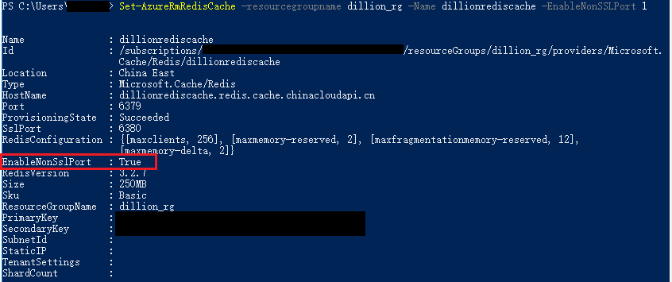

# 使用 Redis-Cli 连接到 Azure Redis 缓存

Azure Redis 可以通过 SSL 端口和非 SSL 端口创建连接。当使用 redis-cli 连接 Azure Redis 缓存时，由于在默认情况下 redis-cli 不支持 SSL ，所以 redis-cli 会通过非 SSL 端口创建连接。如果想要通过 SSL 端口进行访问，可以在客户端机器上为 relis-cli.exe 设置 SSL 代理。

本文主要使用以下两种方式连接到 Azure Redis 缓存。
1. 通过非 SSL 端口连接到 Azure Redis 缓存
2. 通过 SSL 端口连接到 Azure Redis 缓存

## 前提条件

在客户端安装 redis-cli ，本文使用的是 Redis-x64-3.2.100。您可以点击 [这里](https://github.com/MicrosoftArchive/redis/releases) 下载 redis-cli。


## 通过非 SSL 端口连接到 Azure Redis 缓存。

#### 启用非 SSL 端口。

在 [Azure 门户](https://portal.azure.cn/)中使用“浏览”边栏选项卡访问缓存, 选择所需的缓存，在“高级设置”边栏选项卡中的“仅允许通过 SSL 访问”单击“否”，并单击“保存”。


也可以通过 PowerShell 执行以下代码启动非 SSL 端口。

```
Set-AzureRmRedisCache -resourcegroupname dillion_rg -Name dillionrediscache -EnableNonSSLPort 1
```


#### 连接到 Azure Redis 缓存。

使用以下命令连接到 Azure Redis 缓存。

```
redis-cli.exe -h dillionrediscache.redis.cache.chinacloudapi.cn -a hzPlWEsUQGbM4yJiYArVyFs0r38fSVMFjCDZKSQtPxI=
```

截图如下：


## 通过 SSL 端口连接到 Azure Redis 缓存。

#### 通过 [Azure 门户](https://portal.azure.cn/)或使用 Powershell 执行以下命令设置 Azure Redis 缓存仅允许通过 SSL 访问（禁用非 SSL 端口）。

```
Set-AzureRmRedisCache -resourcegroupname dillion_rg -Name dillionrediscache -EnableNonSSLPort 0
```


#### 设置 SSL 代理

* 下载并安装 [stunnel](https://www.stunnel.org/downloads.html)。本文环境：Windows 10 64-bit, stunnel-5.44-win32-installer.exe。

安装完成后可通过以下命令检查是否安装成功：

```
redis-cli -v
```


* 打开 stunnel GUI Start，点击 "**Configuration**" -> "**Edit Configuration**" 。将以下代码添加到配置文件。

```
[redis-cli]
client = yes
accept = 127.0.0.1:6380
connect = dillionrediscache.redis.cache.chinacloudapi.cn:6380
```

截图如下：


* 点击 "**Configuration**"->"**Reload Configuration**"。

* 使用以下命令连接到 Azure Redis 缓存.

```
redis-cli.exe -p 6380 –a <your access key>
```


