# 如何实现 Azure SQL 数据库和本地数据库之间的数据同步

使用 Azure SQL 数据库提供的 SQL 数据同步（预览）这项服务，可以实现跨多个 SQL 数据库和 SQL server 实例双向同步选定的数据。有关数据同步（预览）的详细信息，请参考[使用 SQL 数据同步](https://docs.microsoft.com/azure/sql-database/sql-database-sync-data)。

本文主要介绍如何使用 SQL 数据同步（预览）实现 Azure SQL 数据库和本地数据库之间的数据同步。

1. 创建数据同步组

登录到 Azure 门户，创建中心数据库。

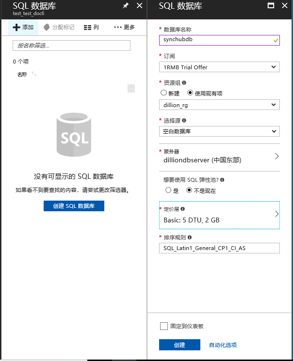

创建成功后，点击“**同步到其他数据库**”，点击“**新建同步组**”。

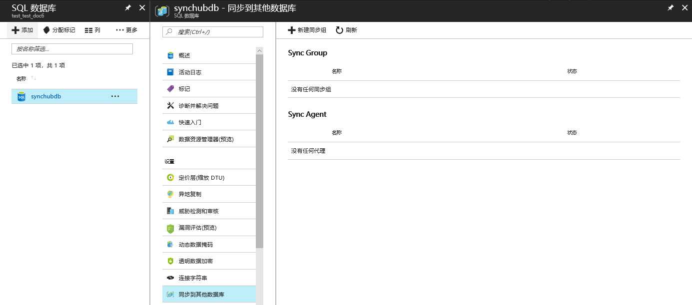

输入同步组名称，选择同步元数据数据库，可以使用现有数据库或者新建一个数据库。打开自动同步并设置同步频率，同步频率最小为 **5** 分钟。冲突解决可以选择“**中心胜出**”或者“**成员胜出**”

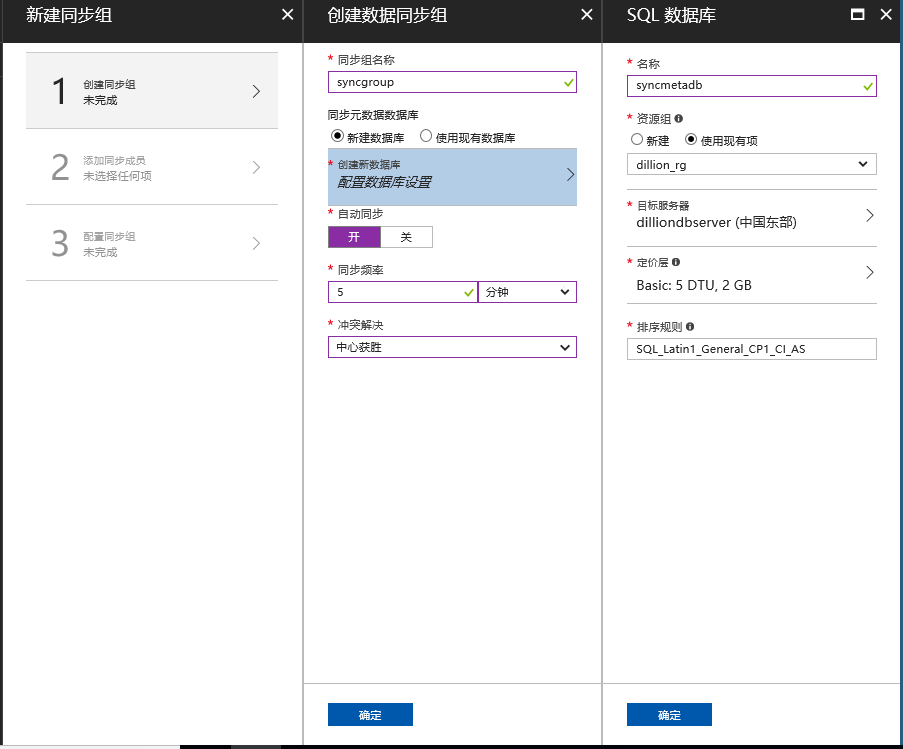

> [!NOTE]
>
> 建议新建空的数据库作为同步元数据库。因为 SQL 数据同步会在该数据库中添加表，记录元数据和日志，如果将中心数据库作为同步元数据库，会增加中心数据库的工作负载。
> 
> 此数据库会自动共享为选定区域中所有同步组的同步元数据数据库。只有在删除同步元数据数据库后，才能更改此数据库或其名称。例如：
> 
> 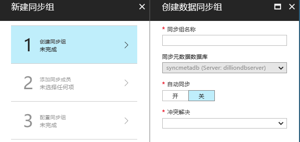

2. 添加同步成员

在中心数据库区域输入中心数据库所在 SQL 数据库服务器的现有凭据，记录凭据，配置客户端代理时需要用到。在成员数据库区域，选择“**添加本地数据库**”。选择“**选择同步代理网关**”，初次设置选择“**创建新代理**”， 点击“**下载**”按钮下载客户端同步代理, 本文使用的是 **Microsoft SQL Azure Data Sync Agent 2.0(X86)** 客户端代理。输入代理名称，并生成代理密钥，复制密钥，配置客户端代理时需要用到。

> [!Important]
> 在客户端安装 **Microsoft SQL Azure Data Sync Agent 2.0(X86)** 之前，需要在客户端安装 **Microsoft System CLR Types for Microsoft SQL Server 2012(X86)** 和 **Microsoft SQL Server 2012 Shared Management Objects(X86)**，您可以从[这里](https://www.microsoft.com/download/details.aspx?id=29065)下载相关的包。

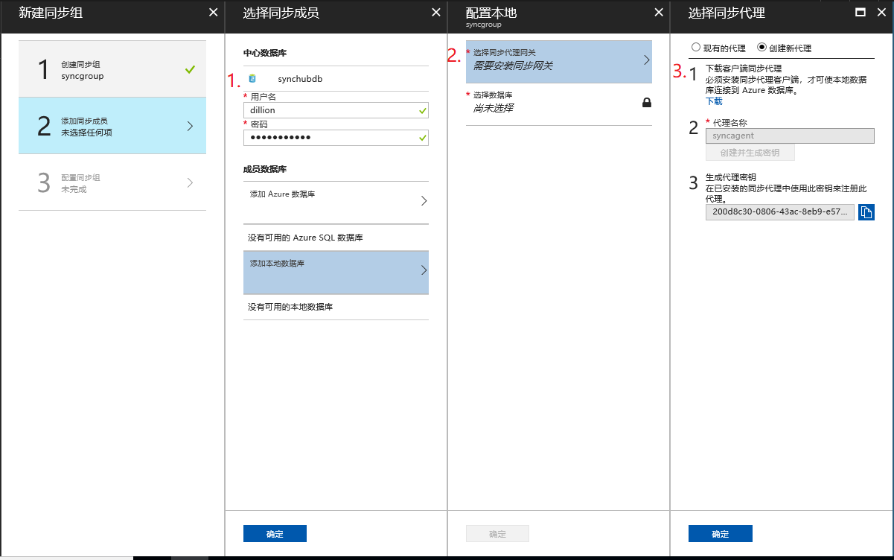

安装客户端代理时，需要输入登录到 Windows 的用户名（域\用户名）和密码。注意：该用户必须可以访问网络。

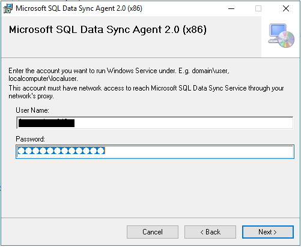

客户端代理安装成功后，打开代理, 点击” **Submit Agent Key Configuration** “按钮配置客户端代理。

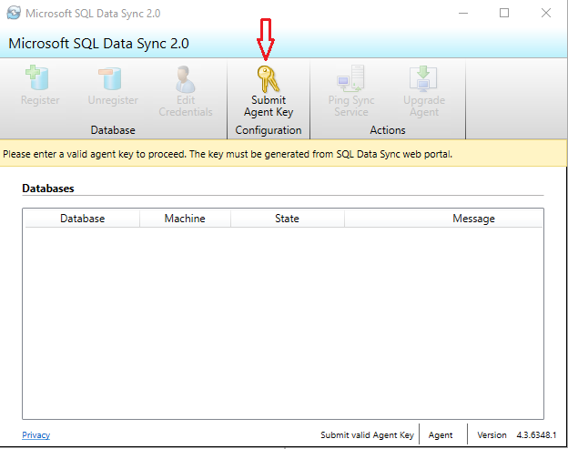

将之前生成的代理密钥复制到” Agent Key “, 输入之前中心数据库凭据用户名和密码。点击”**Test Connection**“按钮，测试是否连接成功

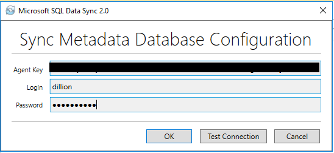

> [!NOTE]
> 
> 如果在测试连接时遇到以下错误信息，请确保 Azure 数据库防火墙打开出站 TCP 端口 1433，并且客户端防火墙也启用了 TCP 1433 端口（出\入站），以便客户端代理能够与服务器进行通信。另外，也要确保用户名密码正确。
> 
> 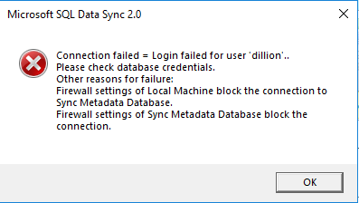

连接成功之后，点击 ”**Register**” 按钮，选择 On_Premise 数据库。

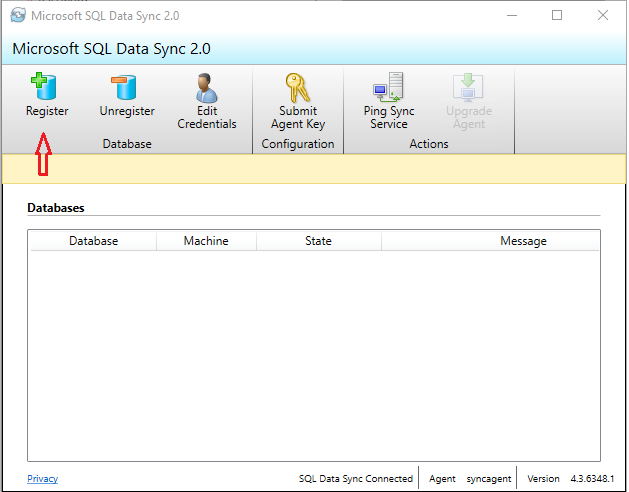

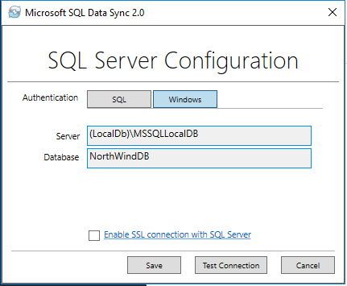

点击 “**Test Connection**” 测试数据库是否连接成功。连接成功后截图如下，可以点击 “**Ping Sync Servie**”按钮测试同步连接情况。

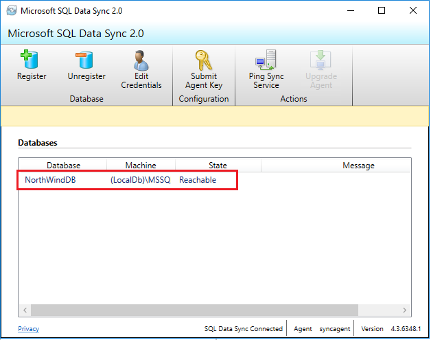

> [!IMPORTANT]
>
> 安装客户端代理后，更改服务帐户的唯一方法是卸载它，然后使用新的服务帐户安装新的客户端代理。

客户端代理和数据库配置成功之后，可点击“**选择数据库**”按钮，输入成员数据库名称，选择客户端配置的数据库，并选择同步方向。

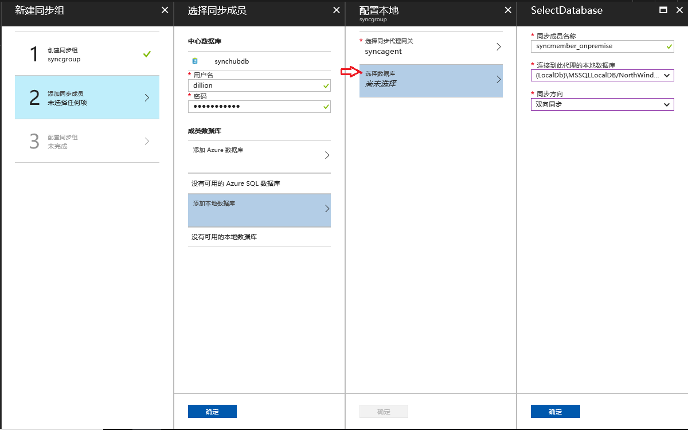

添加本地数据库之后，可以选择要同步的数据表和字段，点击“**保存**”，完成配置。

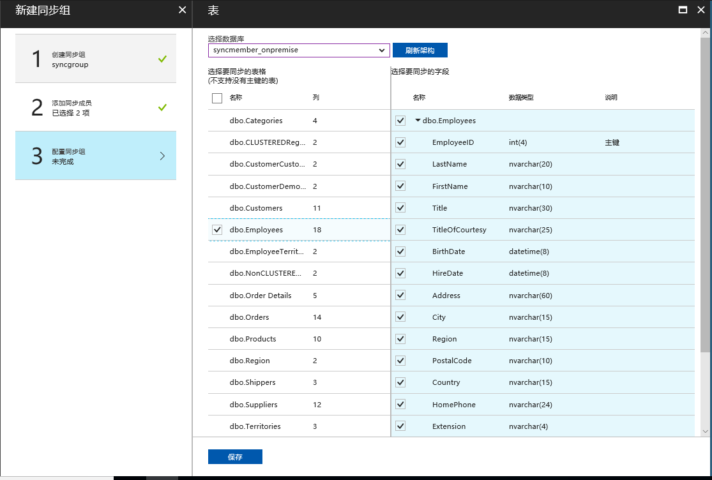

> [!NOTE]
> 
> 在选择要同步的表时，每个表必须要有主键，且主键必须为**聚集索引**。如果主键为非聚集索引，表可以添加到同步组中，但是同步时会遇到一下错误：
> 
> 

通过中心数据库的数据库资源管理器（预览），可以看到数据同步到Azure 中心数据库。

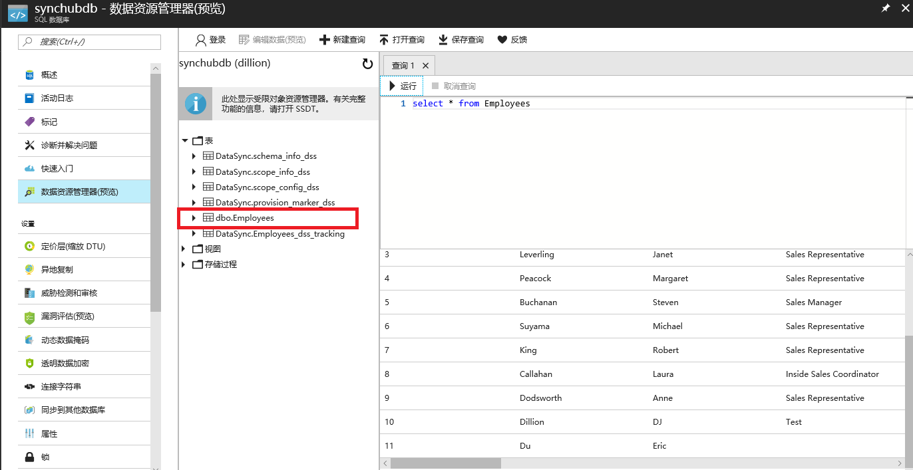

> [!NOTE]
>
> 同步数据的最小频率为 5 分钟，如果要立即同步，可以打开同步组，点击“**同步**“按钮实现同步。

如果需要更改同步组配置，可以点击现有的同步组，然后更改成员数据库或者配置同步表。

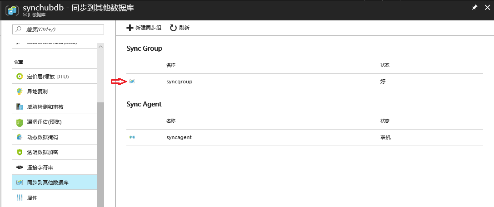

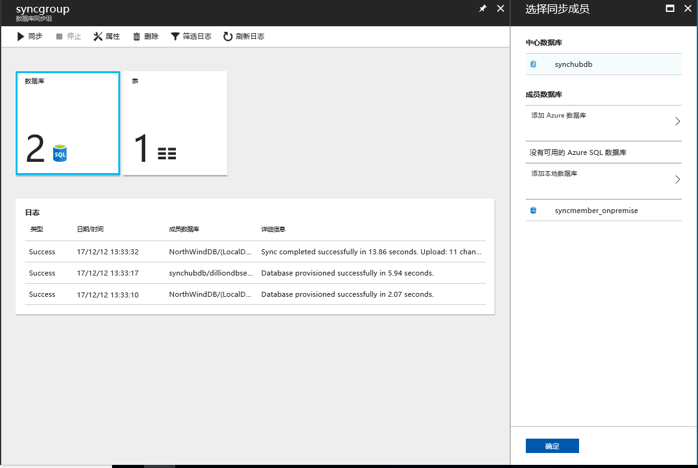