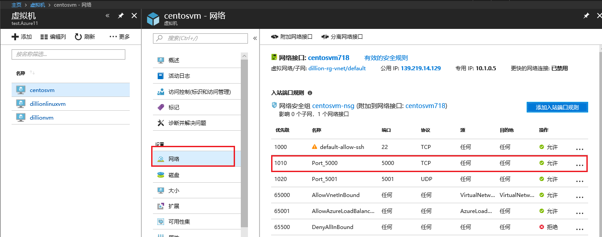
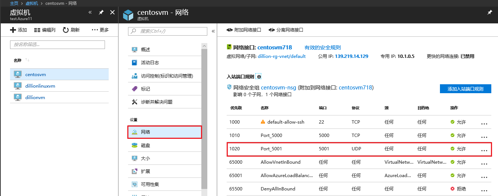
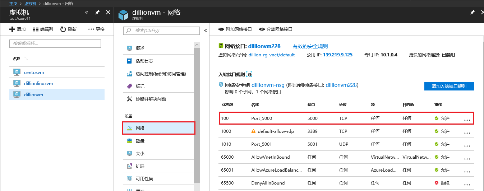
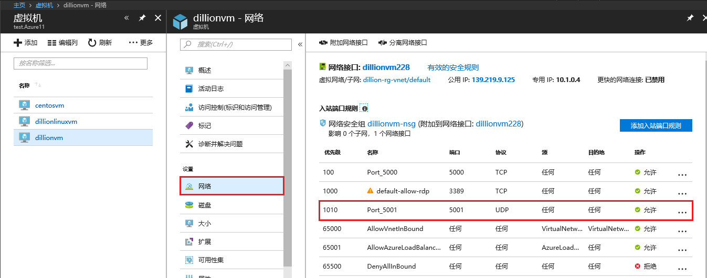

# 使用 Netcat 测试虚拟机 TCP/UDP 端口连通性

Netcat 是一个用于 TCP/UDP 连接和监听的工具，主要用于网络传输和调试。本文主要介绍如何使用 Netcat 测试 Windows/Linux 虚拟机 TCP/UDP 端口的连通性。主要包含以下内容：

- [Linux OS 环境下，使用 Netcat 命令分别测试 TCP/UDP 端口连通性](#linuxos)

- [Windows OS 环境下，使用 Netcat 命令分别测试 TCP/UDP 端口连通性](#windowsos)

## 前提条件

1. 使用 Azure 门户创建 [Linux 虚拟机](https://docs.azure.cn/virtual-machines/linux/quick-create-portal) 和 [Windows 虚拟机](https://docs.azure.cn/virtual-machines/windows/quick-create-portal)。本文 Linux 虚拟机使用的是 CentOS 镜像，Windows 虚拟机使用的是 Windows server 2012 DataCenter 镜像。

2. 在客户端和服务器端虚拟机上分别安装 Netcat 工具。

Linux 虚拟机 ( Centos 版本) 安装命令如下：

```
sudo yum install nc
```

Windows 虚拟机可以从 Internet 下载 Netcat 工具包。

## <a id="linuxos"></a>Linux OS 环境下，使用 Netcat 命令分别测试 TCP/UDP 端口连通性

### 测试 TCP 端口连通性

本示例中使用 Azure Linux 虚拟机做为服务器 ( centosvm ) 和客户端 ( dillionlinuxvm )，通过 5000 端口测试连通性，具体步骤如下：

1. 通过 Azure 门户选中 centosvm 虚拟机，在边栏选项卡中选中网络，在网络安全组中添加入站端口规则，本示例中添加 TCP 5000 端口。



2. 远程连接到 centosvm 虚拟机，安装 Netcat 工具之后，执行以下命令，实现 TCP 方式监听服务器 5000 端口

```
nc -l <端口号> -v
```

> [Note]
> 
> -l：指明 Netcat 处于监听模式；-v：用于显示详细信息。
> 
> 必须要先在服务器端监听端口，然后在客户端访问该端口，建立连接。
> 
> 如果想要退出监听模式，可以使用 Ctrl + C 。

在客户端 dillionlinuxvm 虚拟机上执行以下命令：

```
nc <服务器端 IP 地址> <端口号>
```

在客户端输入如上命令后，可以在客户端输入任意字符，我们可以看到，客户端输入的字符均会在服务器端打印出来。测试结果如下：

客户端：


服务器端：


### 测试 UDP 端口连通性

1. 通过 Azure 门户选中 Linux 虚拟机 ( centosvm )，在边栏选项卡中选中网络，在网络安全组中添加入站端口规则，本示例中添加 UDP 5001 端口。



2. 远程连接到 centosvm 虚拟机，执行以下命令，实现 UDP 方式监听 5001 端口

```
nc -lu <端口号> -v
```

在客户端 dillionlinuxvm 虚拟机上执行以下命令，

```
nc -u <服务器端 IP 地址> <端口号>
```

在客户端输入如上命令后，可以在客户端输入任意字符，我们可以看到，客户端输入的字符均会在服务器端打印出来。测试结果如下：

客户端：


服务器端：


## <a id="windowsos"></a>Windows OS 环境下，使用 Netcat 命令分别测试 TCP/UDP 端口连通性

### 测试 TCP 端口连通性

本示例中使用 Azure Windows 虚拟机做为服务器，本地 Windows 计算机做为客户端，客户端和服务器通过 5000 端口相连，具体步骤如下：

1. 通过 Azure 门户选中当前 Windows 虚拟机 ( dillionvm )，在边栏选项卡中选中网络，在网络安全组中添加入站端口规则，本示例中添加 TCP 5000 端口。



> [Important]
> 
> 对于 Windows 虚拟机，从 Azure 门户添加完入站端口规则之后，需要远程连接到虚拟机，在防火墙中添加相对应的 TCP 入站规则。

2. 远程连接到 Azure Windows 虚拟机，使用 cmd 命令导航至 nc.exe 所在目录，执行以下命令，实现 TCP 方式监听服务器端 5000 端口。

```
nc -l -p <端口号>
```

在本地客户端执行以下命令:

```
nc <服务器端 IP 地址> <端口号>
```

在客户端输入如上命令后，可以在客户端输入任意字符，然后按回车键，我们可以看到，客户端输入的字符均会在服务器端打印出来。测试结果如下：

客户端：


服务器端：


### 测试 UDP 端口连通性

1. 通过 Azure 门户选中当前 Windows 虚拟机 ( dillionvm ) ，在边栏选项卡中选中网络，在网络安全组中添加入站端口规则，本示例中添加 UDP 5001 端口。



> [Important]
> 
> 对于 Windows 虚拟机，从 Azure 门户添加完入站端口规则之后，需要远程连接到虚拟机，在防火墙中添加相对应的 UDP 入站规则。

2. 远程连接到 Azure Windows 虚拟机，使用 cmd 命令导航至 nc.exe 所在目录，执行以下命令，实现 UDP 方式监听服务器 5001 端口。

```
nc -lu -p <端口号> -v 
```

在本地客户端执行以下命令:

```
nc -u <服务器端 IP 地址> <端口号>
```

在客户端输入如上命令后，可以在客户端输入任意字符，然后按回车键，我们可以看到，客户端输入的字符均会在服务器端打印出来。测试结果如下：

客户端：


服务器端：

