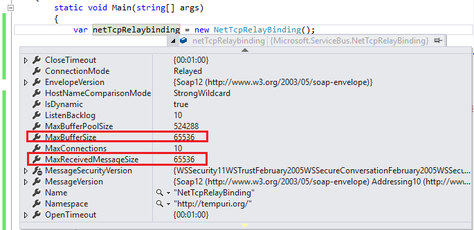
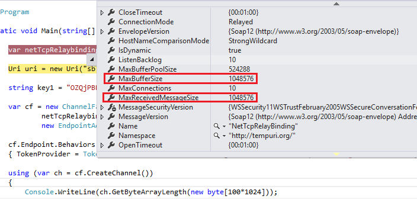

# 使用 netTCPRelay 绑定的 WCF 中继发送大于 64k 消息时报通信异常

## 问题描述

使用 netTCPRelay 绑定的 WCF 中继发送消息时，如果消息小于 64k，程序正常运行；如果消息大于 64k, 就会报通信异常。

## 问题分析

使用 netTCPRelay Windows Communication Foundation (WCF) 绑定打开的中继不将消息视为单条消息，而视为流经系统的数据流。使用此绑定时，只有发送方和侦听器可以识别发送和接收的单条分帧消息。对于使用 netTCPRelay 绑定的中继，所有数据都将被视为用于计算可计费消息的数据流。更多详细信息，请参考[这篇文章](https://docs.azure.cn/zh-cn/service-bus-relay/relay-faq)。

但是在默认情况下，使用 netTCPRelayBinding 时，消息的最大缓冲和接收尺寸为 64k(65536), 所以如果发送的消息大于 64k，就会报通信异常。

## 解决方案

NetTcpRelayBinding 类定义了 [MaxBufferSize](https://docs.microsoft.com/dotnet/api/microsoft.servicebus.nettcprelaybindingbase.maxbuffersize?view=azure-dotnet#Microsoft_ServiceBus_NetTcpRelayBindingBase_MaxBufferSize) 和 [MaxReceivedMessageSize](https://docs.microsoft.com/dotnet/api/microsoft.servicebus.nettcprelaybindingbase.maxreceivedmessagesize?view=azure-dotnet) 属性，通过设置他们的值可以修改上限值。

示例如下：

默认情况下， NetTcpRelayBinding 和 MaxBufferSize 的值为： 65536（64k）。



使用下面的代码设置属性值：

服务主机：

```
    ServiceHost sh = new ServiceHost(typeof(ProblemSolver));
    //设置 MaxBufferSize 和 MaxReceivedMessageSize 的值。
    var netTcpbinding = new NetTcpBinding() { MaxBufferSize = 1024 * 1024, MaxReceivedMessageSize = 1024 * 1024 };
    var netTcpRelayBinding = new NetTcpRelayBinding() { MaxBufferSize = 1024 * 1024, MaxReceivedMessageSize = 1024 * 1024 };

    sh.AddServiceEndpoint(
        typeof(IProblemSolver), netTcpbinding,
        "net.tcp://localhost:9358/solver");

    // 将字符串 namespace 替换为命名空间名称
    Uri uri = new Uri("sb://<namespace>.servicebus.chinacloudapi.cn/solver");
    
    ////将 yourKey 替换为 WCF 中继的 SAS 密钥
    string key1 = "yourKey";

    sh.AddServiceEndpoint(
        typeof(IProblemSolver), netTcpRelayBinding,
        uri)
        .Behaviors.Add(new TransportClientEndpointBehavior
        {
            TokenProvider = TokenProvider.CreateSharedAccessSignatureTokenProvider("RootManageSharedAccessKey", key1)
        });

    sh.Open();

    Console.WriteLine("Press ENTER to close");
    Console.ReadLine();

    sh.Close();
```

客户端：

```
    //设置 MaxBufferSize 和 MaxReceivedMessageSize 的值。
    var netTcpRelaybinding = new NetTcpRelayBinding() { MaxBufferSize=1024*1024, MaxReceivedMessageSize=1024*1024 };

    // 将字符串 namespace 替换为命名空间名称
    Uri uri = new Uri("sb://<namespace>.servicebus.chinacloudapi.cn/solver");
    
    ////将 yourKey 替换为 WCF 中继的 SAS 密钥
    string key1 = "yourKey";

    var cf = new ChannelFactory<IProblemSolverChannel>(
            netTcpRelaybinding,
            new EndpointAddress(uri));

    cf.Endpoint.Behaviors.Add(new TransportClientEndpointBehavior
    { TokenProvider = TokenProvider.CreateSharedAccessSignatureTokenProvider("RootManageSharedAccessKey", key1) });

    using (var ch = cf.CreateChannel())
    {
        Console.WriteLine(ch.GetByteArrayLength(new byte[100*1024]));
    }
```

截图如下：



结果如下：


## 参考文档

[WCF 中继](https://docs.azure.cn/service-bus-relay/relay-wcf-dotnet-get-started)

[中继常见问题](https://docs.azure.cn/service-bus-relay/relay-faq)

[NetTcpRelayBinding 类](https://docs.microsoft.com/dotnet/api/microsoft.servicebus.nettcprelaybindingbase?view=azure-dotnet)