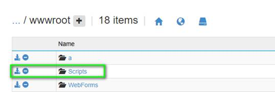
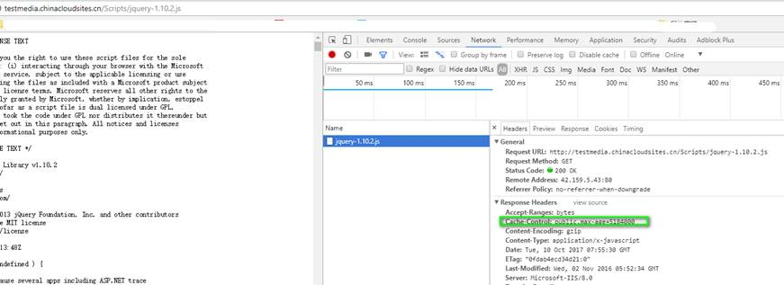
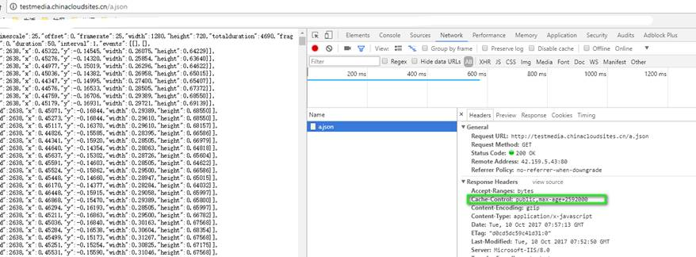

# web 应用中如何设置静态文件缓存过期时间

## **问题描述**

在使用 Azure Web 应用时，如何设置静态文件缓存过期时间。

## **问题分析**

目前， Azure Web 应用都是基于 IIS 转发的，我们可以在 wwwroot 中配置 web.config 来设置缓存过期时间。

## **解决办法**

IIS 可以基于不同的文件夹来进行配置规则，例如，设置 Scripts 文件夹中的静态文件的缓存过期时间为 60 天，其他静态文件过期时间为 30 天，则需要配置规则如下：



```XML
<configuration>
  <system.webServer>
        <staticContent> 
         <!-- Set expire headers to 30 days for static content-->
         <clientCache cacheControlCustom="public" cacheControlMode="UseMaxAge" cacheControlMaxAge="30.00:00:00" />
         <mimeMap fileExtension=".json" mimeType="application/x-javascript" />
        </staticContent> 
  </system.webServer>

   <location path="Scripts">
    <system.webServer>
      <staticContent>
        <clientCache cacheControlCustom="public" cacheControlMode="UseMaxAge" cacheControlMaxAge="60.00:00:00" />
      </staticContent>
    </system.webServer>
  </location>
</configuration>
```

这样 Scirpts 文件夹中静态资源的缓存缓存时间为 60 天。



其余静态资源的缓存时间为 30 天。



## **参考文档**

关于 IIS 配置缓存规则，请参考 IIS 官网文档：[Client Cache](https://docs.microsoft.com/iis/configuration/system.webserver/staticcontent/clientcache)。