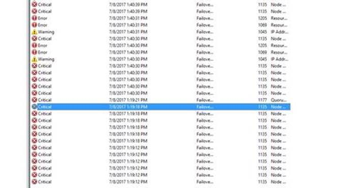
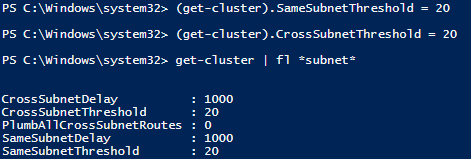

# Azure 虚拟机中的 SQL Server AlwaysOn 可用性组集群配置最佳实践

考虑和本地环境的一致性以及 SQL Server 丰富的功能和管理的自由度等因素，很多企业会选择在 Azure 虚拟机中自己搭建一套 SQL Server 可用性组，有很多因素可以造成 AlwaysOn 可用性组发生故障转移，这篇文章主要介绍其中一种由于网络延迟而导致的故障转移，同时介绍规避这种问题的最佳实践。

下面我们以一个故障转移的实例来做一些分析：

某 SQL Server AlwaysOn 可用性组在某一时刻发生了故障转移，虽然服务很快恢复，但是我们依然好奇是什么原因导致了这次故障转移，以及我们是否有什么措施可以避免故障发生。

问题分析需要涉及到的日志有：

* SQL Server 错误日志 (error log)
* AlwaysOn 可用性组所在的 Windows 集群的集群日志 (Cluster log)
* 各个 Windows 节点上面的事件日志 (event log)

从故障发生前的主节点的错误日志中，我们可以看到类似下面这样的日志信息：

```
XXXX-XX-XX XX:XX:XX.XX spid44s     The local availability replica of availability group 'XXX' is in a failed state.  The replica failed to read or update the persisted configuration data (SQL Server error: 41034).  To recover from this failure, either restart the local Windows Server Failover Clustering (WSFC) service or restart the local instance of SQL Server.
XXXX-XX-XX XX:XX:XX.XX Server      AlwaysOn Availability Groups: Local Windows Server Failover Clustering node is no longer online. This is an informational message only. No user action is required.
XXXX-XX-XX XX:XX:XX.XX spid28s     Failed to update Replica status within the local Windows Server Failover Clustering (WSFC) due to exception 41005.
XXXX-XX-XX XX:XX:XX.XX spid52s     AlwaysOn: The availability replica manager is going offline because the local Windows Server Failover Clustering (WSFC) node has lost quorum. This is an informational message only. No user action is required.
```

而在集群日志中我们看到由于 Lost Quorum 导致 failover 发生：

```
00000690.00001438:: XXXX-XX-XX XX:XX:XX.XX ERR   [QUORUM] Node 4: Lost quorum (4)
00000690.00001438:: XXXX-XX-XX XX:XX:XX.XX ERR   [QUORUM] Node 4: goingAway: 0, core.IsServiceShutdown: 0
00000690.00001438:: XXXX-XX-XX XX:XX:XX.XX ERR   lost quorum (status = 5925)
```

同时，在事件日志中，我们看到问题发生时有很多 `Event ID 1135`:

```
The description for Event ID 1135 from source Microsoft-Windows-FailoverClustering cannot be found. Either the component that raises this event is not installed on your local computer or the installation is corrupted. You can install or repair the component on the local computer.
```

综合上面的各种日志中得到的信息，给出下面的分析结果和相关建议：
当我们使用 Cluster 的标准设置搭建 Cluster 的时候，系统使用的是针对于本地数据中心网络的配置。这种配置并没有考虑到当虚拟机运行在多租户公有云平台时，由于多租户共享网络带宽而可能出现的网络延时情况，比如，微软的 Azure 平台。

当 Cluster 建立完成后，Cluster 服务会持续监控各个节点的网络连接状况和各个 Cluster 节点的健康状况。如果一个节点在网络上不可被访问到，Cluster 服务将会采取修复的行为，即将此节点运行的服务转移到其他的节点上。在这种情况下，我们经常会看到 1135 的事件日志。在我们的系统上，正是遇到了这种情况。节点 `T-BJ-SQL-06` 由于没能及时相应节点之间的心跳包，被认为在网络上丢失，因此此节点的 Cluster 服务被强制重启，其上运行的资源被 failover 到其他节点。



Cluster 使用心跳来判断节点的健康状况，他通过以下两个参数来判断：

* **Delay** – 定义了节点之间以秒为单位发送心跳包的时间间隔。由于节点可能在同一个子网或不同子网，我们可以根据网段设置不同的间隔。
* **Threshold** – 这个数据定义了当有几次心跳数据丢失后，Cluster 开始采取修复的动作。同样，根据子网段的不同，可以定义不同的阈值

考虑到多租户网络的特殊性，我们建议对 Cluster 的配置作以下调整 :

<table>
    <tr>
        <td rowspan="2" width="160">Windows Server 2012 R2</td>
        <td>CrossSubnet Threshold</td>
        <td>缺省=5</td>
        <td>建议=20</td>
    </tr>
    <tr>
        <td>SameSubnet</td>
        <td>缺省=5</td>
        <td>建议=10~20</td>
    </tr>
</table>

<table>
    <tr>
        <td rowspan="2" width="160">Windows Server 2016</td>
        <td>CrossSubnet Threshold</td>
        <td>缺省=20</td>
        <td>建议=20</td>
    </tr>
    <tr>
        <td>SameSubnet</td>
        <td>缺省=10</td>
        <td>建议=10~20</td>
    </tr>
</table>

建议通过以下的命令来设置 :


