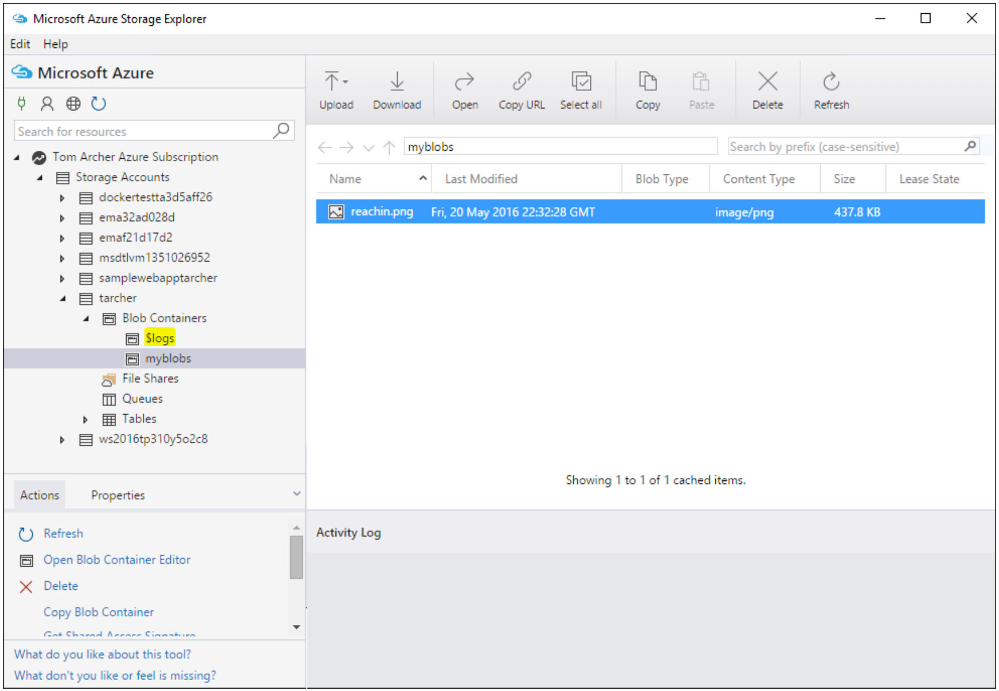

# Azure 存储分析日志常见问题

Windows Azure 存储分析日志提供对存储帐户（Blob，表和队列）执行的请求的跟踪。它允许您监视对存储帐户的请求，了解各个请求的性能，分析特定容器和 Blob 的使用情况，以及在请求级别调试存储 API。

本文结合[存储分析](https://docs.azure.cn/zh-cn/storage/common/storage-analytics)主题，对文档中未提及或未明确的部分进行说明。

## 如何开启 Azure 存储分析日志？

[监视 Azure 门户中的存储帐户](https://docs.azure.cn/zh-cn/storage/common/storage-monitor-storage-account)主题中的[配置日志记录](https://docs.azure.cn/zh-cn/storage/common/storage-monitor-storage-account#configure-logging)章节提供了开启日志记录的步骤。

## 什么会被记录？

您可以控制为您的帐户记录哪些类型的请求。 我们将请求分为 3 种： READ, WRITE 和 DELETE 操作。 您可以设置每个服务的日志记录属性，指示其感兴趣的操作类型。例如，选择为 Blob 服务记录删除请求将导致 Blob 或容器删除动作被记录下来。 类似地，记录读取和写入将捕获对应服务中文件属性或实际文件对象的读/写动作。每一个选项都必须显式设置为 true（捕获数据）或 false（不捕获数据）。

## 何种请求会被记录？

以下经过身份验证或匿名的请求会被记录：

* 经过身份验证的请求：
    * 成功的请求。
    * 失败的请求，包括超时、限制、网络、授权和其他错误。
    * 使用共享访问签名 (SAS) 的请求，包括失败和成功的请求。
    * 分析数据的请求。
* 匿名的请求：
    * 成功的请求。
    * 服务器错误。
    * 客户端和服务器的超时错误。
    * 失败的 GET 请求，错误代码为 304（未修改）。

以下请求不会被记录：

* 经过身份验证的请求：
    * 存储分析本身发出的请求，如创建或删除日志。
* 匿名的请求：
    * 所有其他失败的匿名请求。

在服务正常运行期间，所有请求都会被记录; 但是要注意，日志记录是尽力而为的。 这意味着我们不保证每个消息都将被记录，因为日志数据被缓存在存储前端的内存中，在被写出之前，如果重新启动一个前端节点，那么节点的缓冲区中的日志将会丢失。

## 存储日志包含什么数据，以什么格式排列？

[存储分析日志格式](https://msdn.microsoft.com/library/hh343259.aspx)主题中提供了所记录数据的格式说明。

## 哪些 API 动作会被记录？

[存储分析记录的操作和状态消息](https://msdn.microsoft.com/library/hh343260.aspx)主题中提供了会被记录的 API 动作列表。

## 什么是客户端请求 ID？

日志中的一个记录字段称为客户端请求 ID（Client Request Id）。 客户端可以选择在每个请求中的 HTTP 头 `x-ms-client-request-id` 字段中填充这个客户端请求 ID，使这个 ID 被记录在请求中。 请注意，如果使用可选的客户端请求 ID，它会被用在构建规范化的请求头中，因为所有的标题以 “X-MS” 开始的字段都是用于标识请求的资源标准化的一部分。

由于这个 ID 会被视为与某个客户端的请求相关联，因此它在调查由于网络或超时错误而失败的请求时非常有帮助。 例如，您可以使用给定的客户端请求 ID 搜索日志中的请求，以查看请求是否超时，或查看端到端延迟以确定网络连接速度是否过慢。如前文所述，如果节点故障，某些请求可能无法记录。

## 我在哪里可以找到日志，系统如何存储它们？

[存储分析日志记录](https://docs.azure.cn/zh-cn/storage/common/storage-analytics#about-storage-analytics-logging)章节中的如何存储日志部分提供了日志存储的位置，访问日志记录数据部分提供了访问日志的方法。

用户也可以通过[存储资源管理器](https://docs.azure.cn/zh-cn/vs-azure-tools-storage-manage-with-storage-explorer)访问 $log 容器中的日志。

## 操作 $log 容器和操作日志数据

如上所述，一旦启用日志记录，您的日志数据将以块 Blob 的形式存储在帐户的 Blob 命名空间中的名为 $logs 的容器中。您可以使用 `https://<accountname>.blob.core.chinacloudapi.cn/$logs` 访问 $logs 容器。要列出您的日志，您可以使用 `List blobs` API。日志按照服务类型（Blob，表和队列）进行存储，并按每种服务类型中的生成日期/时间进行排序。 $logs 容器下的日志名称将具有以下格式：`<service name>/YYYY/MM/DD/hhmm/<Counter>.log`

以下操作是 $logs 容器上允许的操作：

* 在 $logs 容器中列出 Blob。

    > [!NOTE]
    > 在帐户名称空间中列出所有容器的结果将不会显示 $logs。

* 在 $logs 容器下读取已提交的 Blob。

* 删除特定日志。

    > [!NOTE]
    > 可以删除日志，但不能删除容器本身。

* 获取日志的元数据/属性。

每种类型操作的示例请求如下：

* 列出日志

    `GET http://sally.blob.core.chinacloudapi.cn/$logs?restype=container&comp=list`

* 从 2011-03-24 05:00 至 05:59 列出为 Blob 服务生成的日志

    `GET http://sally.blob.core.chinacloudapi.cn/$logs?restype=container&comp=list&prefix=blob/2011/03/24/0500/&include=metadata`

* 下载特定日志

    `GET http://sally.blob.core.chinacloudapi.cn/$logs/blob/2011/03/24/0500/000000.log`

* 删除特定日志

    `Delete http://sally.blob.core.chinacloudapi.cn/$logs/blob/2011/03/24/0500/000000.log`

为了改进枚举日志，您可以在使用列表 Blobs API 时传递前缀。例如，要按日期生成日期/时间来过滤 Blob，您可以在使用列表 Blobs API 时将日期/时间作为前缀（blob/2011/04/24 /）传递。
列出 2011 年 3 月份为 Blob 服务生成的所有日志将按如下方式完成：`http://myaccount.blob.core.windows.net/$logs?restype=container&comp=list&prefix=blob/2011/03`

您可以使用前缀过滤到特定小时。例如，如果要扫描 2011 年 3 月 24 日下午 6 点（18:00）生成的日志，请使用 `http://myaccount.blob.core.windows.net/$logs?restype=container&comp=list&prefix=blob/2011/03/24/1800/`

要注意，仅当对服务的请求存在时才会写入日志条目。例如，如果一个小时内帐户没有表活动但是有 Blob 活动，则不会为表服务创建日志，但是您将有一些用于 Blob 服务的日志。如果在接下来的一小时内有表活动，则会在该小时内创建表日志。

## 日志的可扩展性目标和容量限制是什么？这是否与存储帐户有关？

存储分析的容量和规模与您账户的常规服务分开。存储分析数据最大可拥有了 20TB 容量（包括指标和日志数据），这不属于单个帐户的 500TB 容量限制。另外，$logs 会保存在存储帐户的另一部分命名空间内，因此与存储帐户的常规服务会分开进行 IO 限流。同时，Azure 存储服务本身发出的生成或删除日志的请求不会影响[可伸缩性和性能目标](https://docs.azure.cn/zh-cn/storage/common/storage-scalability-targets)文章中描述的各分区或存储账户可扩展性目标或容量限制。

## 如何清理我的日志？

为了简化您的日志管理，我们提供了保留策略的功能，它将自动清理旧日志，而无需为清理支付费用。建议您为日志设置保留策略，以便您的分析数据容量不会超出上述的存储分析数据的 20TB 容量限制内。

保留策略的最大期限为 365 天。一旦设置了保留策略，当日志超出策略中设置的天数时，系统将删除日志。此类懒惰删除将在后台进行。保留策略可以随时关闭，但一旦设置，即使关闭日志功能，仍会强制执行保留策略。例如：如果将日志记录的保留策略设置为 Blob 服务的 10 天，则如果内容时长超过 10 天，则 Blob 服务对应的所有日志将被删除。如果您不设置保留策略，则可以通过手动删除 Blob 或表实体来管理数据。

有关保留策略的详细信息，请参阅[设置存储分析数据保留策略](https://msdn.microsoft.com/library/azure/hh343263.aspx)。

## 在日志记录时会发生何种计费？

[存储分析计费](https://docs.azure.cn/zh-cn/storage/common/storage-analytics#billing-for-storage-analytics)章节提供了存储分析服务计费的相关信息。

## 相关内容

- [了解 Azure 存储计费 - 带宽、事务和容量](http://blogs.msdn.com/b/windowsazurestorage/archive/2010/07/09/understanding-windows-azure-storage-billing-bandwidth-transactions-and-capacity.aspx)
- [Windows Azure 存储日志：使用日志跟踪存储请求](https://blogs.msdn.microsoft.com/windowsazurestorage/2011/08/02/windows-azure-storage-logging-using-logs-to-track-storage-requests/)
- [Windows Azure 存储指标：使用指标跟踪存储用量](https://blogs.msdn.microsoft.com/windowsazurestorage/2011/08/03/windows-azure-storage-metrics-using-metrics-to-track-storage-usage/)