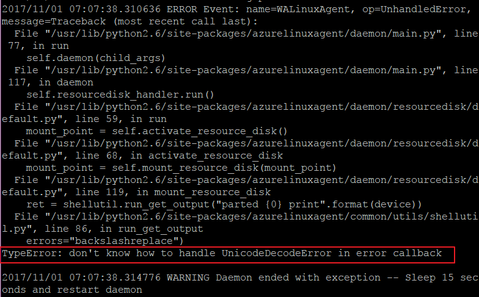

# Linux 配置中文字符集导致诊断设置无法正常工作的问题解决

当客户在修改 Linux 虚拟机默认字符集为中文字符集(`zh_CN.gb2312`)之后，遇到虚拟机的性能监控和诊断不可用。

> [!IMPORTANT]
> 以下测试环境为 CentOS，其他操作系统略有不同，请注意区分。

## 问题分析

Linux 虚拟机的诊断和性能监控是通过 waagent 服务来安装 LinuxDiagnostic 扩展到虚拟机内部来收集虚拟机的内部诊断和性能监控信息。当虚拟机默认的字符集从英文字符集（`en_US.UTF-8`）改为中文字符集（`zh_CN.gb2312`），waagent 服务在启动过程中会遇到奔溃，从而无法正确启动诊断服务关键进程（mdsd）,在门户管理网站查看虚拟机的性能监控时，也会显示数据不可用等报错。连带着 waagent 服务无法正确启动，临时盘也不会自动挂载起来供虚拟机使用，以下是 waagent 启动报错的范例。

## 解决方法

1. 以管理员身份登录虚拟机，切换到 root 用户。
2. 编辑字符集配置文件: `<CentOS 6.x> /etc/sysconfig/i18n` 或者 `<CentOS 7.0> /etc/locale.conf` 文件。
3. 将 LANG 的值改为 `en_US.UTF-8`。
4. 保存并退出。
5. 重启虚拟机使其生效。

如果上述两个方案依然无法解决问题, 请及时联系 Azure 技术支持中心, 获取更深入的支持和帮助。