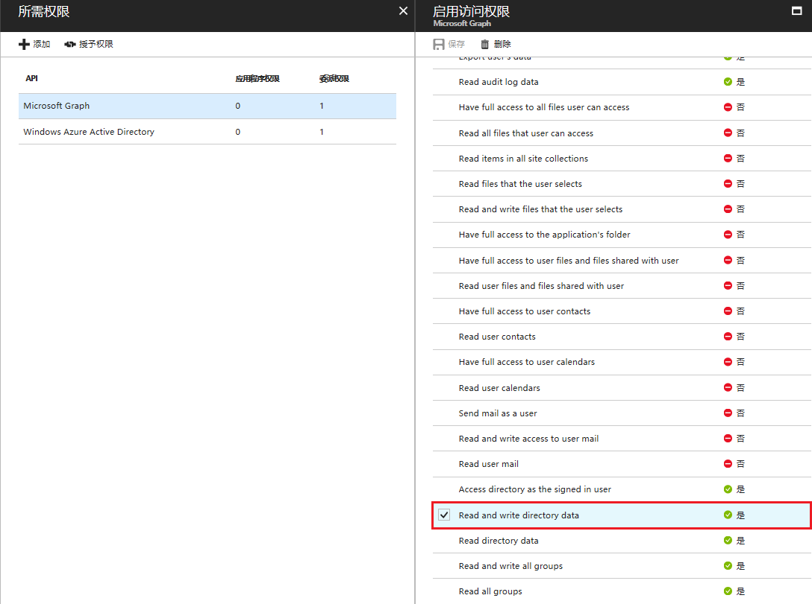
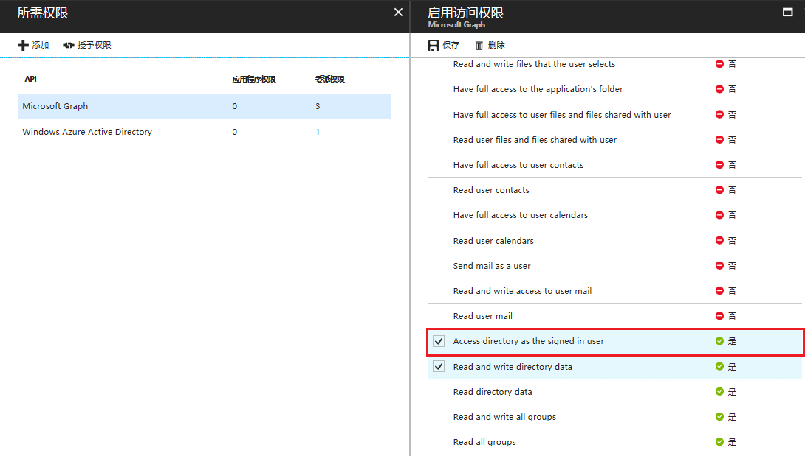

# 如何解决 Azure Active Directory Graph API 无法删除用户或组

## 问题描述

Azure Active Directory (AD) Graph API 通过 OData REST API 终结点提供对 Azure AD 的编程访问权限。 应用程序可以使用 Azure AD Graph API 对目录数据和对象执行创建、读取、更新和删除 (CRUD) 操作。 例如，可以使用 Azure AD Graph API 创建新用户、查看或更新用户的属性、更改用户的密码、检查基于角色的访问的组成员身份、禁用或删除用户。

然而用户在使用 Azure AD Graph API 时出现以下状况：

用户赋予了 Graph API : Read and write directory data 权限（即： Directory.ReadWrite.All）:



发现可以创建、读取以及更新用户和组的信息，但是在进行删除用户或组的操作时却出现权限不足(403)的情况：

`Insufficient privileges to complete the operation.`

## 问题分析

参考官方文档 [Microsoft Graph 目录权限](https://developer.microsoft.com/zh-cn/graph/docs/concepts/permissions_reference#directory-permissions)，可以发现在 Directory.ReadWrite.All 的权限说明中明确指出了**不允许应用删除用户或组，或重置用户密码**的操作：

> [!IMPORTANT]
> | 权限 | 显示字符串 | 说明 | 需经过管理员同意 |
> | ---- | --------- | ---- | -------------- |
> | Directory.ReadWrite.All | 读取和写入目录数据 | 允许应用读取和写入组织目录中的数据，如用户和组。它不允许应用删除用户或组，或重置用户密码。 | 是 |

## 解决方法

### 将应用程序添加至全局管理员/公司管理员角色

关于**全局管理员/公司管理员**角色说明参考官方文档 [Azure Active Directory 可用的角色](https://docs.azure.cn/zh-cn/active-directory/active-directory-assign-admin-roles-azure-portal#available-roles):

> [!NOTE]
> **全局管理员/公司管理员**：与此角色的用户有权访问 Azure Active Directory，以及对 Exchange Online、SharePoint Online 和 Skype for Business Online 等 Azure Active Directory 联合的服务中的所有管理功能。 注册 Azure Active Directory 租户的人员将成为全局管理员。 只有全局管理员才能分配其他管理员角色。 公司中可以有多个全局管理员。 全局管理员可以为任何用户和所有其他管理员重置密码。
> 在 Microsoft Graph API、Azure AD Graph API 和 Azure AD PowerShell 中，此角色标识为“公司管理员”。 在 Azure 门户中则为“全局管理员”。

由于目前还不可以在 Azure 门户上进行该操作，所以我们需要使用 Azure ActiveDirectory PowerShell 模块
(MSOnline)，具体操作步骤如下：

1. 安装 [MSOnline PowerShell for Azure Active Directory](https://www.powershellgallery.com/packages/MSOnline/1.1.183.8)。

2. 使用以下命令将应用程序添加至全局管理员/公司管理员角色：

    ```powershell
    # authenticate to your tenant with your Administrator Account
    Connect-MsolService -AzureEnvironment AzureChinaCloud

    # Then we need to get the Object ID of both the Service Principal we want to elevate, and the Company Administrator Role for your tenant.
    # Search for Service Principal by App ID GUID:
    $sp = Get-MsolServicePrincipal -AppPrincipalId <App ID GUID>
    # Search for Directory Role by Name
    $role = Get-MsolRole -RoleName "Company Administrator"
    # Now we can use the Add-MsolRoleMember command to add this role to the service principal.
    Add-MsolRoleMember -RoleObjectId $role.ObjectId -RoleMemberType ServicePrincipal -RoleMemberObjectId $sp.ObjectId
    # To check everything is working, lets get back all the members of the Company Administrator role:
    # You should see your application in that list, where RoleMemberType is ServicePrincipal and DisplayName is the name of your application.
    Get-MsolRoleMember -RoleObjectId $role.ObjectId
    ```

通过以上步骤就可以将您的应用添加到全局管理员/公司管理员角色了，此时您的应用程序就获得了全局管理员的所有权限，再通过 Graph API 就可以完成用户或组的删除操作了：

`Connection returned HTTP code: 204 with message: No Content`

### 对于应用程序类型为本机的应用程序，可以在 Azure 门户上直接为 Microsoft Graph 添加：Access directory as the signed-in user（即：Directory.AccessAsUser.All） 权限

1. 使用全局管理员身份的用户登录 [Azure 门户](https://portal.azure.cn)。

2. 选择您的应用程序：Azure Active Directory -> 应用注册 -> <您的应用程序>。

3. 为您的应用程序添加 Access directory as the signed in user 权限：

    

完成以上操作后，您就可以使用 Graph API 进行用户或组的删除操作了。

## 参考文档

- [在 Azure Active Directory 中分配管理员角色](https://docs.azure.cn/zh-cn/active-directory/active-directory-assign-admin-roles-azure-portal#available-roles)
- [Microsoft Graph 权限引用](https://developer.microsoft.com/zh-cn/graph/docs/concepts/permissions_reference#directory-permissions)
- [Microsoft Graph - Delete a user](https://developer.microsoft.com/en-us/graph/docs/api-reference/v1.0/api/user_delete)
